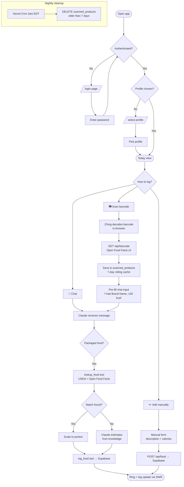

# Calorie Chat

A personal, conversational calorie tracker. Instead of searching a food database yourself,
you **talk to Claude** — it looks up foods in **USDA** and **Open Food Facts**, asks clarifying
questions, scales calories to your portion, and logs the result. You can also scan a barcode to
instantly pull a packaged product's exact figures. It tracks your **goal weight**, a **daily
calorie limit**, and **weight over time** with a progress chart and goal-date forecast.

Built with Next.js 16, Supabase, and the Vercel AI SDK (Claude Sonnet 4.6). Supports multiple
**profiles** (e.g. you + partner) behind one shared password — each tracked separately.
Installable as a PWA.

---

## How it works

### Food logging flow



### What happens on a chat turn

1. **You type** — e.g. *"I had a Chobani vanilla yogurt"*
2. **Claude checks** your recently scanned products (injected in the system prompt) — if you
   scanned that yogurt in the last 7 days, it already knows the exact calories and logs it
   immediately.
3. **If not cached**, Claude calls `lookup_food` → searches USDA and Open Food Facts in
   parallel → picks the best match → scales to your portion.
4. **If no database match** (restaurant meal, homemade dish), Claude estimates from model
   knowledge and explains its reasoning.
5. **`log_food`** writes to Supabase; the response includes your updated daily total.
6. **SWR revalidates** on the client → the calorie ring animates to the new total.

### Barcode scanning

Tap the barcode icon in the chat composer → camera opens → point at any grocery barcode →
ZXing decodes it in the browser → the server looks up the product in Open Food Facts' dedicated
product API (`/api/v2/product/{barcode}`) → the result is saved to `scanned_products` (7-day
rolling cache) → the chat input pre-fills with *"I had [Brand Product], X kcal"* → send it →
Claude logs it using the exact figure from the scan.

Rescanning the same barcode refreshes the timestamp so it stays in cache for another 7 days.
A Vercel Cron job at 2am EDT deletes any entries older than 7 days.

---

## Features

- **Chat to log** — describe a meal; Claude searches USDA + Open Food Facts, clarifies portions,
  estimates (database-first, knowledge fallback), and logs.
- **Barcode scan** — camera icon in the chat composer; scans EAN/UPC barcodes and pulls exact
  product data from Open Food Facts. Scanned products cached for 7 days so Claude remembers
  exact figures without rescanning.
- **Manual entry** — add by hand (with backdating up to 7 days) when you'd rather not chat.
- **Calorie ring** — daily budget ring that fills and animates as you log; green → amber → red
  as you approach and exceed your limit.
- **Day navigation** — day strip to review/log any of the last 7 days; 7-day rolling average
  (logged days only — empty days excluded).
- **Weight tracking** — quick daily weigh-in (one entry per day).
- **Progress charts** — weight over time with a dashed goal line, plus daily-calorie history.
- **Goal-date forecast** — least-squares trend over your weigh-ins projects when you'll hit your
  goal. Shown on Progress and answerable in chat (*"when will I hit my goal?"*).
- **Assistant notes** — free-text personal context (dietary restrictions, usual portions, brands
  you use) stored in Settings and injected into every chat session.
- **Multiple profiles** — one shared password; each profile has its own data, goals, and assistant
  notes. Adding profiles is a one-line SQL insert (see [Adding profiles](#adding-profiles)).
- **Installable (PWA)** — add to your phone's home screen; runs full-screen with a themed status
  bar.

---

## Tech

Next.js 16 (App Router, Turbopack) · React 19 · Tailwind CSS v4 · Vercel AI SDK v6
(`@ai-sdk/anthropic`, `claude-sonnet-4-6`) · Supabase (Postgres, service-role) · Recharts ·
`@zxing/browser` (barcode scanning) · Oswald / Ubuntu / Ubuntu Mono.

---

## Setup (from scratch)

### 1. Create a Supabase project

- Go to [supabase.com](https://supabase.com) → New project.
- Open **SQL Editor → New query**, paste [`supabase/schema.sql`](supabase/schema.sql), and run it.
  This creates all six tables (`profiles`, `settings`, `food_entries`, `weight_entries`,
  `chat_messages`, `scanned_products`) and enables RLS on each (see security note below).
- Copy the **Project URL** and **`service_role` key** from Project Settings → API Keys.

### 2. Configure environment

```bash
cp .env.local.example .env.local
```

| Variable | What it is |
| --- | --- |
| `ANTHROPIC_API_KEY` | From [console.anthropic.com](https://console.anthropic.com). Powers the chat. |
| `USDA_API_KEY` | Free from [api.data.gov](https://api.data.gov/signup/). Powers USDA food lookup. Open Food Facts needs no key. |
| `SUPABASE_URL` | Your Supabase project URL. |
| `SUPABASE_SERVICE_ROLE_KEY` | The secret `service_role` key (server-side only — keep secret). |
| `APP_PASSWORD` | The passphrase you'll type to unlock the app. |
| `AUTH_SECRET` | Random string for signing the session cookie. `openssl rand -hex 32`. |
| `CRON_SECRET` | Random string Vercel uses to authenticate the nightly cleanup cron. `openssl rand -hex 32`. |

### 3. Run locally

```bash
npm install
npm run dev
```

Open http://localhost:3000 → `/login` → `/select-profile` → Today.

> Node 24+ required. Uses **npm** (no pnpm).

### 4. First steps

1. Go to **Settings** (or just tell Claude) and set your **daily calorie limit** and **goal weight**.
2. Say *"I had two scrambled eggs and buttered toast."* Claude estimates and logs — the ring
   animates live.
3. Log your weight: *"I weigh 182 today"* or use the quick-weight box.
4. Check **Progress** to watch your weight line trend toward the goal.

---

## Deployment

Push to GitHub and connect the repo to Vercel. Set all env vars (see table above plus `CRON_SECRET`)
in the Vercel project settings for Production.

> **Reachability:** Disable Vercel's "Deployment Protection → Vercel Authentication" — the app
> has its own password gate and doesn't need Vercel's SSO wall in front of it.

---

## Architecture reference

### Key files

| File | Purpose |
| --- | --- |
| `proxy.ts` | Auth gate + profile guard (Next 16 middleware) |
| `app/api/chat/route.ts` | Streams Claude with the full toolset |
| `app/api/barcode/route.ts` | Barcode lookup → OFF → saves to scanned_products |
| `app/api/cron/cleanup/route.ts` | Deletes scanned_products older than 7 days |
| `lib/tools.ts` | All Claude tools (`lookup_food`, `log_food`, etc.) |
| `lib/nutrition/` | USDA + Open Food Facts fetch + normalize |
| `lib/assistant.ts` | System prompt builder (cached + fresh split for caching) |
| `lib/queries.ts` | All Supabase queries, scoped by `profile_id` |
| `lib/forecast.ts` | Least-squares goal-date projection |
| `lib/themes.ts` | CSS token palette (default theme; extend to add per-profile palettes) |
| `lib/timezone.ts` | Fixed app timezone (`America/New_York`) helpers |
| `components/BarcodeScanner.tsx` | Full-screen camera modal (ZXing, dynamically imported) |
| `components/TodayPageContent.tsx` | Main Today layout (chat + ring + log + weight rail) |

### Cost controls

- **History trimmed to today** — `loadHistory` in `app/page.tsx` filters `chat_messages` to
  the current calendar day (midnight New York → UTC), so yesterday's conversation never loads.
- **Message trimming** — only the last 12 messages are sent to the model per turn (not the full
  history), so per-message cost stays flat as the day progresses.
- **Prompt caching** — the system prompt is split into a stable block (persona + prefs + notes,
  marked `cacheControl: ephemeral`) and a fresh block (today's date + running total + recent
  scans). The stable block caches together with the tool definitions, cutting repeat-turn cost
  to roughly 1/10th of the input rate.

### Security model

All database access is server-side via the Supabase **service-role key** (bypasses RLS; never
sent to the browser). RLS is enabled on all tables with **no policies** — this fully locks out
public roles while the service-role path keeps working. The app's **password gate** (`proxy.ts`
+ `AUTH_SECRET`) is the sole access control.

---

## Adding profiles

The app ships with one profile (`user1`). Everyone who logs in shares the same password but
picks a profile — data is fully separate per profile.

### Add a profile via SQL

Run this in your Supabase SQL editor (Dashboard → SQL Editor):

```sql
-- 1. Create the profile row (id must be URL-safe; name is the display label)
insert into public.profiles (id, name, ord) values ('user2', 'User 2', 2);

-- 2. Create the matching settings row (inherits defaults)
insert into public.settings (profile_id) values ('user2');
```

The new profile will appear on the profile picker the next time someone logs in.

### Remove a profile

```sql
delete from public.profiles where id = 'user2';
```

Because all child tables (`food_entries`, `weight_entries`, `chat_messages`, `settings`) use
`on delete cascade`, this removes all associated data in one statement.

### Rename a profile

Display names are editable in-app at **Settings → Your name**, or directly in SQL:

```sql
update public.profiles set name = 'Alice' where id = 'user1';
```

The `id` (slug stored in the cookie) stays unchanged; only the display name updates.

---

## Design system

Components use **semantic CSS tokens** (`bg-paper`, `bg-clay`, `text-accent`, …) defined in
`app/globals.css`. Token values swap per theme via `[data-theme]` on `<html>`.

| Token | Role |
| --- | --- |
| `--clay` | Primary structure (nav, secondary buttons, user chat bubbles) |
| `--accent` | Primary CTA (buttons, focus rings, calorie ring, `#ff7300` orange) |
| `--olive` / `--amber` / `--rust` | Status: under / approaching / over budget |
| `--paper` / `--surface` | Page background / card background |
| `--ink` / `--ink-muted` | Body text / secondary text |

All profiles share the default **"Enterprise" palette** — bone `#EDEADE`, teal `#072c2c`, orange
`#ff7300`. To add a per-profile theme: add a `ProfileTheme` constant in `lib/themes.ts` (keyed
by the profile's `id`) and a matching `[data-theme="id"]` CSS block in `app/globals.css`.
